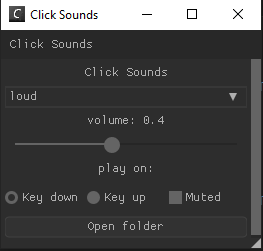
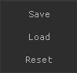

Key Board sounds that are customizable

Features
* You can add your own sounds
* Cross Platform
* Open-schorce
* Can play on either key up or key down
* Mute button
* Runs in backround
* Saves and loads your settings 

  Made with the following libraries:
  * glfw
  * glew
  * [Nuklear](https://github.com/Immediate-Mode-UI/Nuklear)
  * [Miniaudio](https://github.com/mackron/miniaudio)
  * [uiohook](https://github.com/kwhat/libuiohook)
  * [nlohmann json](https://github.com/nlohmann/json)
